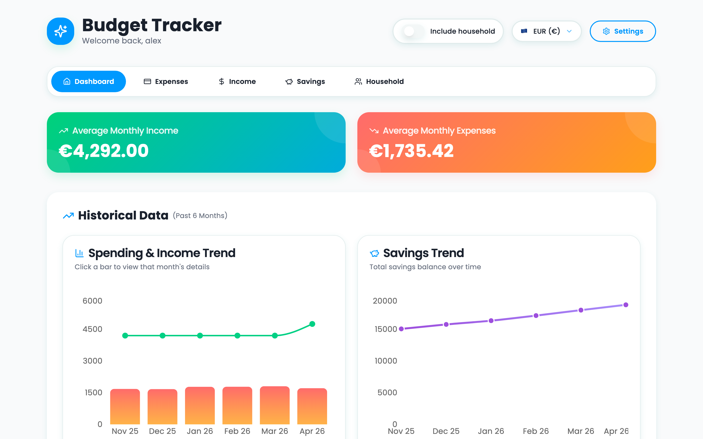
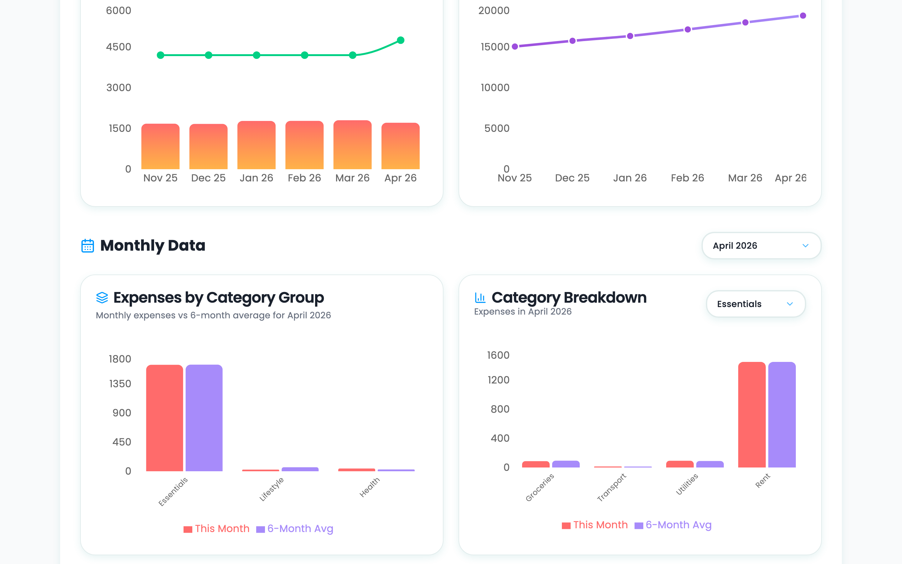
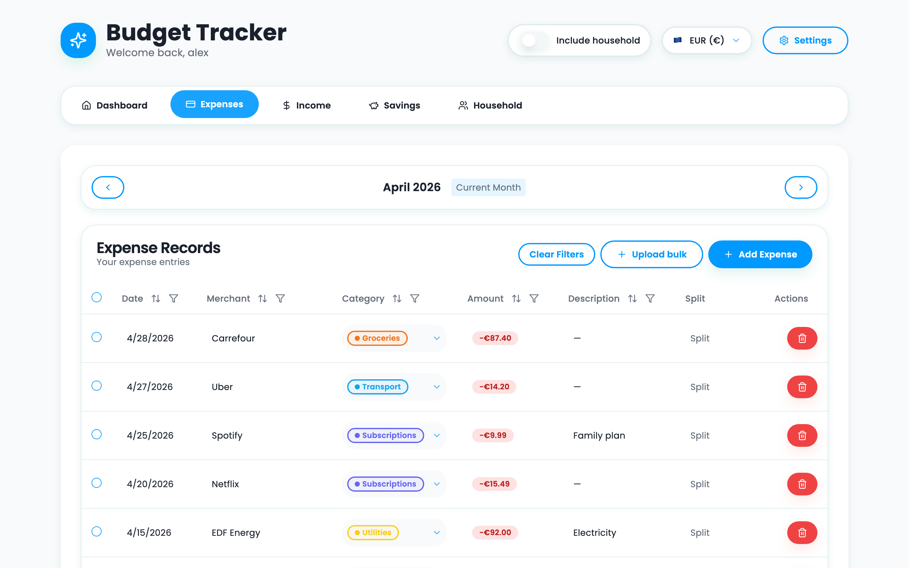
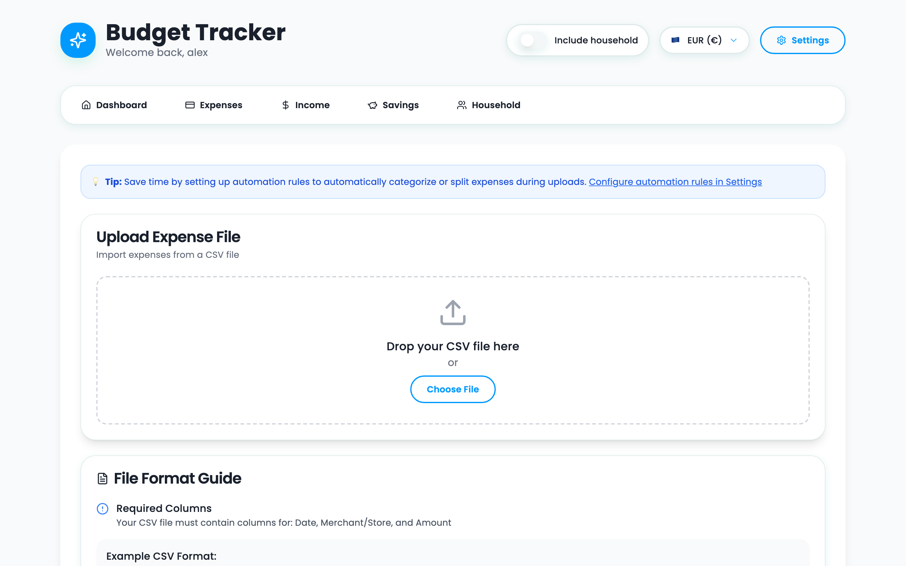
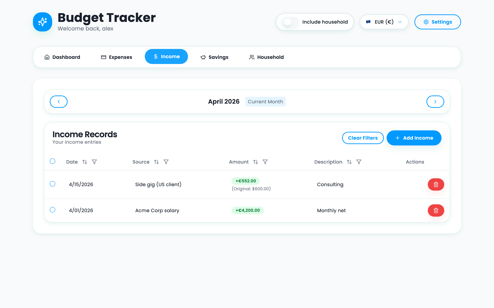
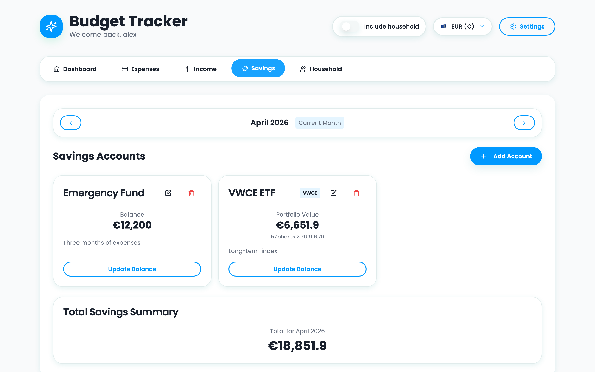
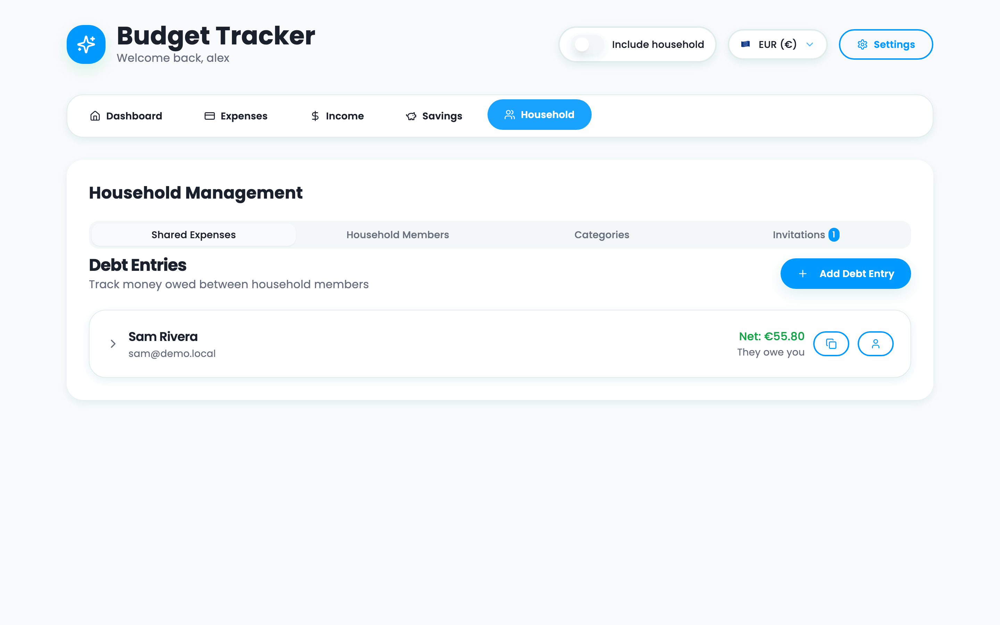
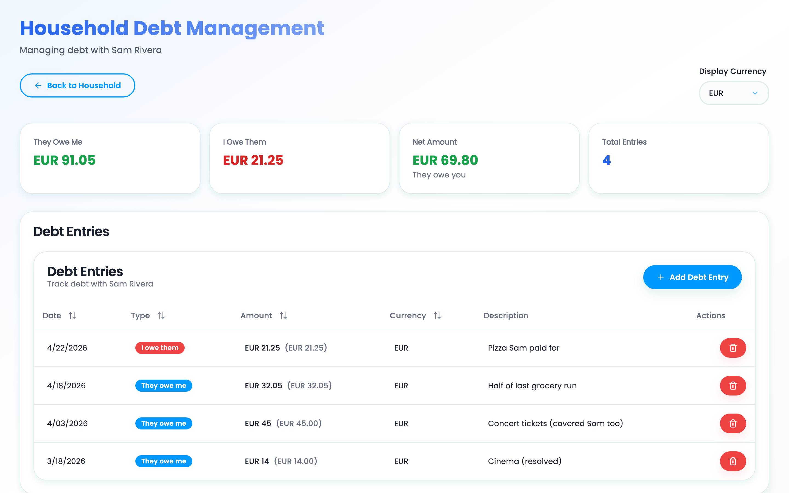
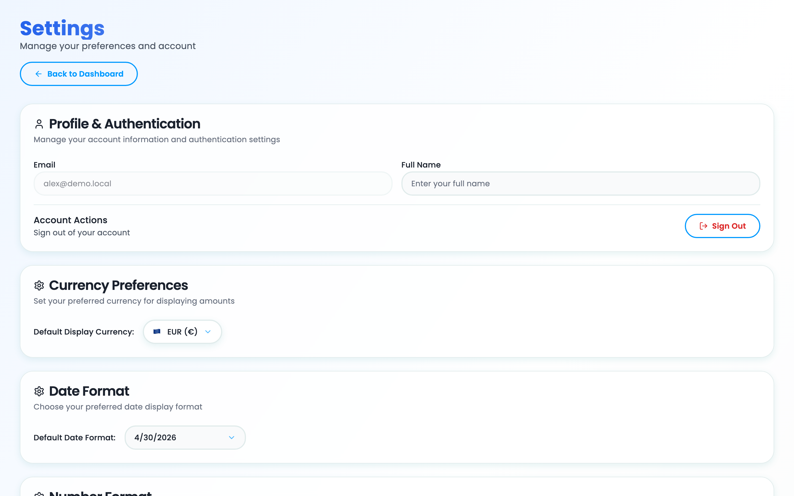

# Shared Budget Sheets

**Live app:** https://shared-budget-sheets.netlify.app

A household budget tracker where **your data lives in your own Google Spreadsheet**. Track expenses, income, savings, and shared debts — the browser talks straight to the Google Sheets and Drive APIs. There is no backend collecting your finances.



---

## Why a spreadsheet backend

- **You own the data.** It's a Google Spreadsheet in your Drive. You can open it, share it, audit it, export it, or delete it without our cooperation.
- **No service to trust.** The app is a static SPA; auth and storage are with Google. Nothing transits a server we run.
- **Works with what you already have.** No signup, no separate password, no extra account.

What you grant: read/write access to spreadsheets the app creates (`drive.file` scope — Drive can't see your other files), plus your email and name for the profile screen.

---

## Quickstart

```bash
git clone https://github.com/<your-fork>/shared-budget-sheets.git
cd shared-budget-sheets
cp .env.example .env          # paste your VITE_GOOGLE_CLIENT_ID (see below)
npm install
npm run dev                   # http://localhost:8080
```

You need a Google Cloud OAuth client ID before the app will load — see [Google Cloud setup](#google-cloud-setup) below.

### Try it without Google setup (demo mode)

Append `?demo=1` to any URL and the app boots against an in-memory dataset — no auth, no Drive, no Sheets. Useful for poking around before deciding whether to wire up your own spreadsheet.

```bash
npm run dev
open "http://localhost:8080/?demo=1"
```

The same fixtures are used to generate the screenshots in this README — see [`scripts/take-screenshots.mjs`](scripts/take-screenshots.mjs).

---

## Features

### Dashboard

Month-over-month spending trends, income vs. expense, category breakdown, savings progress, and a fixed-expenses detector that flags merchants showing up in 3+ consecutive months.



### Expenses

Inline-edit list with multi-currency display, per-category grouping, and optional household scope. Each expense can be split across household members, attached to a debt entry, or tagged with custom categories.



### CSV import with auto-categorisation

Upload a bank-export CSV, map columns once, and the app remembers merchant→category pairings for next time. Automation rules can auto-split, re-categorise, or delete rows by merchant or description pattern before you hit Save.



### Income

Same shape as expenses — inline edit, multi-currency, household-aware. Used by the dashboard to compute net cash flow.



### Savings

Track savings vehicles (cash accounts or stock holdings) with monthly snapshots. Stocks store quantity + price; cash stores a balance. Charts on the dashboard plot the monthly trend.



### Household sharing

Invite people by email or by a shareable join link. Once they accept, you both see the same expenses, income, and savings entries via a "Include household data" toggle in the header. Categories from your personal sheet can be mapped onto the household's category list at join time.



### Debt & splits

Split any expense across household members (fixed amount or percentage). The app tracks per-person balances so you always know who owes whom. Mark debts as resolved when settled.



### Settings

Per-user display preferences for date format, number format, and display currency. All persisted to `localStorage`. Currency conversion uses a direct rate or USD as a pivot.



---

## Google Cloud setup

You'll need an OAuth client ID to run the app — locally or deployed. This is a one-off:

1. Open [Google Cloud Console](https://console.cloud.google.com/) and create (or pick) a project.
2. Enable the **Google Sheets API** and **Google Drive API** under *APIs & Services → Library*.
3. Under *APIs & Services → Credentials*, create an **OAuth 2.0 Client ID** of type *Web application*.
   - **Authorised JavaScript origins:** `http://localhost:8080` (and your deployed URL, e.g. `https://your-site.netlify.app`)
   - **Authorised redirect URIs:** same as above
4. On the **OAuth consent screen**, add these scopes:
   - `openid`
   - `email`
   - `profile`
   - `https://www.googleapis.com/auth/spreadsheets`
   - `https://www.googleapis.com/auth/drive.file`
5. While the app is in **Testing** mode, add your own Google account as a test user.
6. Copy the client ID into `.env`:
   ```
   VITE_GOOGLE_CLIENT_ID=xxxxxxxxxx.apps.googleusercontent.com
   ```

When you sign in for the first time, the app will offer to create a fresh spreadsheet in your Drive or paste the URL of an existing one.

---

## Run locally

```bash
npm install
npm run dev                   # http://localhost:8080
```

The dev server **must** run on port 8080 — the OAuth client's authorised origins need to match exactly.

```bash
npm run build                 # production build → dist/
npm run preview               # serve dist/ locally
npm run lint                  # eslint
```

---

## Deploy (Netlify)

A [netlify.toml](netlify.toml) is included with the SPA-fallback redirect and asset cache headers. The Netlify CLI is bundled as a devDependency.

**First-time setup** (opens a browser to log in and link the project):

```bash
npm run netlify:login
npm run netlify:init          # creates a new Netlify site or links an existing one
```

`netlify:init` writes `.netlify/state.json` with the site id (gitignored).

**Deploys**:

```bash
npm run deploy                # builds and pushes a draft (preview URL)
npm run deploy:prod           # builds and pushes to production
```

After your first production deploy, add the Netlify URL to the OAuth client in Google Cloud Console under **Authorised JavaScript origins** and **Authorised redirect URIs**, then redeploy.

**No-CLI alternative:** run `npm run build` and drop the contents of `dist/` onto https://app.netlify.com/drop.

---

## Architecture

```
Browser (React 18 + Vite + shadcn-ui)
  ├── AuthContext            Google OAuth token (in-memory) + spreadsheet linking
  ├── GoogleSheetsService    All CRUD via Sheets REST API v4
  ├── DriveService           Create / find / share spreadsheets via Drive API v3
  └── 16 sheet tabs          One tab per "table"; row 1 = headers; col A = id
```

Every record lives in a Google Spreadsheet the user owns; sharing is the spreadsheet's own ACL. Tokens are held in memory only; the user profile is cached in `localStorage` so silent re-auth runs on reload. All cell values are stored as strings; hooks deserialize on read.

Full architecture, data model, feature map, and conventions: [docs/CLAUDE.md](docs/CLAUDE.md). Known issues: [docs/BUGS.md](docs/BUGS.md). Roadmap: [docs/PHASE4_PLAN.md](docs/PHASE4_PLAN.md).

---

## Project status

This started as a personal-use tool and is being prepared for public release. Cleanup, refactor, and docs/audit milestones are done.

| Phase | Status |
|---|---|
| 1 — Cleanup (dead code / deps) | done |
| 2 — Refactor (structure, conventions) | done |
| 3 — Docs & bug audit | done |
| 4 — Publish-ready | ready for private beta (see [PHASE4_PLAN.md](docs/PHASE4_PLAN.md)) |

Contributions and issues welcome.

## License

[MIT](LICENSE).
